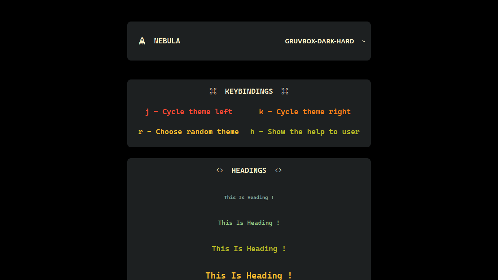
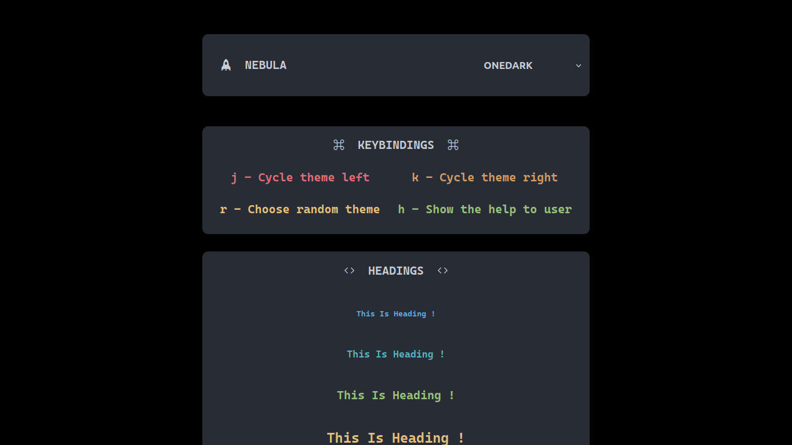
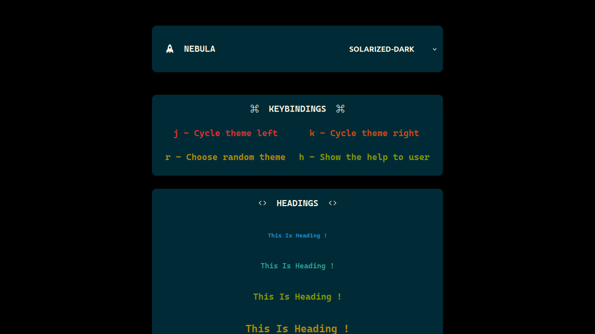
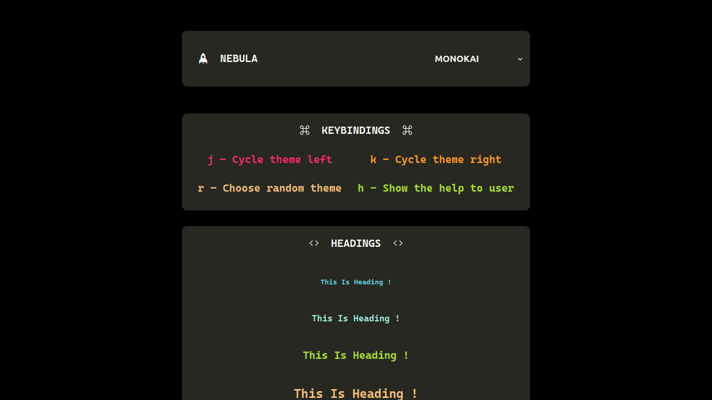
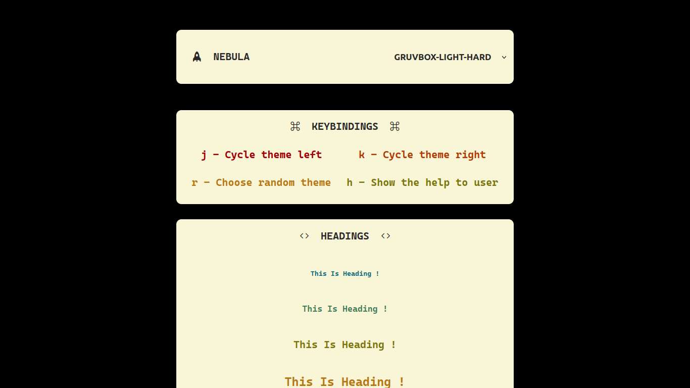
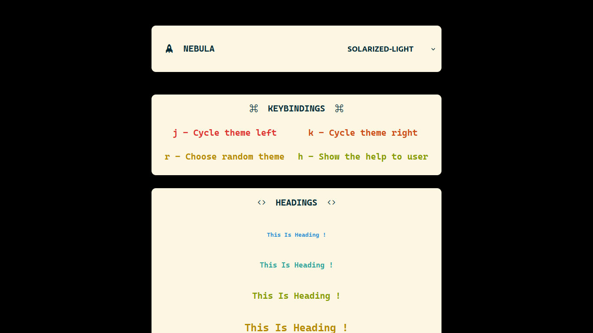

# Nebula

🚀 Nebula - The Collection Of CSS Themes (Like Gruvbox, Solarized)








Preview website: https://alexthegreat600.github.io/nebula

# Usage

Copy the css themes in `css/` to your project's css folder.

```bash
cp css/theme.css path_to_your_project/css/
```

Include the specific theme in your html file.

```html
<link rel="stylesheet" href="css/specific-theme.css" id="nebula">
```

Now use those css variables for styling.

See `script.js` to see example of keybindings, cycle themes, change theme and radnom theme select.

# Support

Just give me a star, that's enough.

